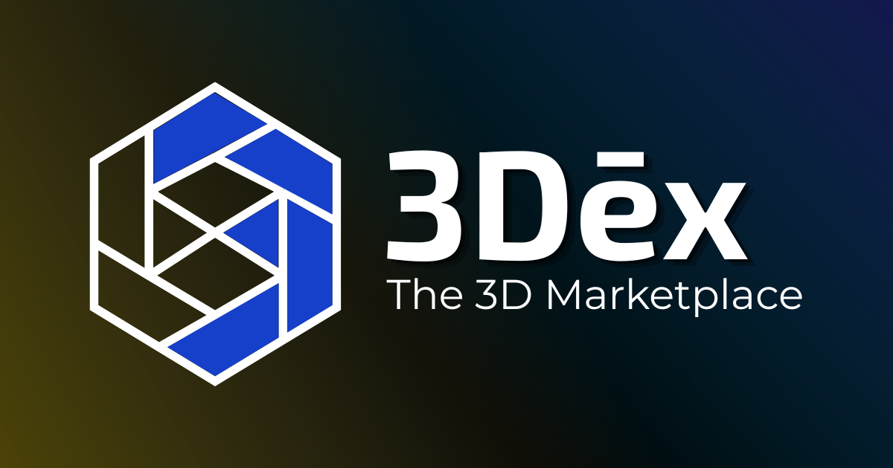
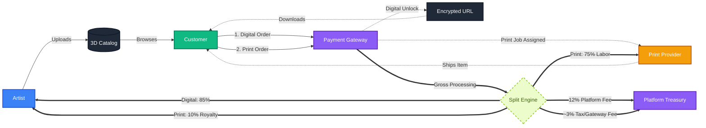

# 3Dēx

<p align="center">
  
</p>

<p align="center">
    
    
    
    
    <br />
    
    
    
    
    
    
    <br />
    
    
    
    
    
    <br />
    
    
    
    
    
</p>

3Dēx is a 3D services and asset marketplace where clients can hire 3D artists and purchase 3D assets, featuring real-time previews rendered in the browser.

This repository contains both the frontend and backend for the platform.

---

## Table of Contents
- [Features](#features)
- [Actors & Business Model](#actors--business-model)
- [Tech Stack](#tech-stack)
- [Project Structure](#project-structure)
- [Getting Started](#getting-started)
- [Contributor Guidelines](#contributor-guidelines)
- [License](#license)
- [Primary Contributors](#primary-contributors)

---

## Features
- Authentication & Authorization (Secure JWT + Role-based Access)
- Interactive 3D Services Marketplace (Providers & Print Services)
- Digital Asset Marketplace (Models, Textures, HDRIs) with Advanced Search
- Community Feed & Interactions (Posts, Likes, Comments)
- Content Moderation & NSFW Filtering (Blurring, Content Flags, Admin Approvals)
- Unified Library Hub (Consolidated Saved, Downloads, and My Uploads)
- Artist & Provider Analytics Dashboards
- Secure File Storage (MinIO/S3 Presigned URLs)
- Client-Side 3D Previews (Optimized interactive canvas)
- Order Management & Payment Integration (Midtrans Sandbox / Production)
- **Dēxie AI Assistant** (Emu x Ako persona, contextual situational AI)

---

## Actors & Business Model

3Dēx operates as a multi-sided marketplace, connecting creators, consumers, and physical manufacturers into a single unified ecosystem. 

### I. System Actors
- **Guest**: Unregistered user browsing the catalog and interacting with the 3D viewer.
- **Customer**: Authenticated user capable of purchasing digital downloads, requesting physical prints, and participating in the social feed.
- **Artist**: Content creator who uploads 3D models and sets dual pricing (Personal vs. Commercial licenses).
- **Provider**: Verified hardware partner capable of fulfilling specialized physical 3D print orders via localized manufacturing.
- **Admin**: Platform maintainer responsible for content moderation, dispute resolution, and trust & safety.

### II. Business Flow & Revenue Routing
The platform bridges the gap between digital artists and hobbyists without hardware, monetizing through a combination of direct sales and print-on-demand fulfillment.



### III. Profit Splits & Taxation
To ensure a fair and sustainable ecosystem, revenue is automatically routed and split upon a successful transaction:
- **Digital Sales Split**:
  - **85%** - Artist Payout.
  - **12%** - Platform Operations Fee (maintenance, hosting, AI costs).
  - **~3%** - Payment Gateway Fee & Taxes (Midtrans processing + standard VAT).
- **Physical Print Split**:
  - **75%** - Provider Payout (covers 3D printing material, electricity, and labor).
  - **10%** - Artist Royalty (for licensing the 3D model for physical reproduction).
  - **12%** - Platform Operations Fee.
  - **~3%** - Payment Gateway Fee & Taxes.

---

## Tech Stack
- Frontend: Next.js, React, React Query, Tailwind CSS
- Backend: Node.js, Express
- Database: PostgreSQL
- ORM: Prisma
- Storage: MinIO (S3 Compatible)
- **AI Ecosystem:** Google Gemini (Generative AI)
- Version Control: Git & GitHub

---

## Project Structure
```
3Dex/
├─ .github/           # GitHub Actions workflows
├─ .vscode/           # Editor settings
├─ apps/
│  ├─ backend/        # Express + Prisma backend
│  └─ frontend/       # Next.js frontend
├─ docs/              # Project documentation
├─ docker-compose.yml # Docker configuration
├─ ecosystem.config.js # PM2 configuration
├─ LICENSE            # Project license
├─ package.json       # Workspace dependencies
└─ README.md          # Primary documentation
```
---

## Getting Started
Refer to the following guide for initial setup and development:

[dev.md](./docs/dev.md) — complete setup, installation, Git workflow, and troubleshooting.

For further architectural references, see the [Documentation Index](./docs/README.md).

---

## Contributor Guidelines
We welcome contributions! Please see our [Contributing Guide](CONTRIBUTING.md) for details on our branching strategy and code philosophy.
Also, please review our [Code of Conduct](CODE_OF_CONDUCT.md).

---

## License
This project is licensed under the **GNU Affero General Public License v3.0 (AGPL-3.0)**.

You are free to use, study, modify, and distribute this software under the terms of the AGPL-3.0.  
Any distributed modifications (including those offered over a network) must also be licensed under AGPL-3.0 and made available as open source.

See the [LICENSE](./LICENSE) file for full details.

## Primary Contributors
- **I Nyoman Widiyasa Jayananda** "[Schryzon](https://github.com/Schryzon)" (Backend, SysAdmin, Project Manager)
- **I Kadek Mahesa Permana Putra** "[Vuxyn](https://github.com/Vuxyn)" (Frontend, UI/UX, QA)
- **Thoriq Abdillah Falian Kusuma** "[ganijack](https://github.com/ganijack)" (Frontend, Integration, OAuth)

## Secondary Contributors
- **Ni Putu Ayu Dian Sulastri** (Documentation, Proposal, Competition Assistant)
- **Mataram Dev community** (Hosting, Support)
