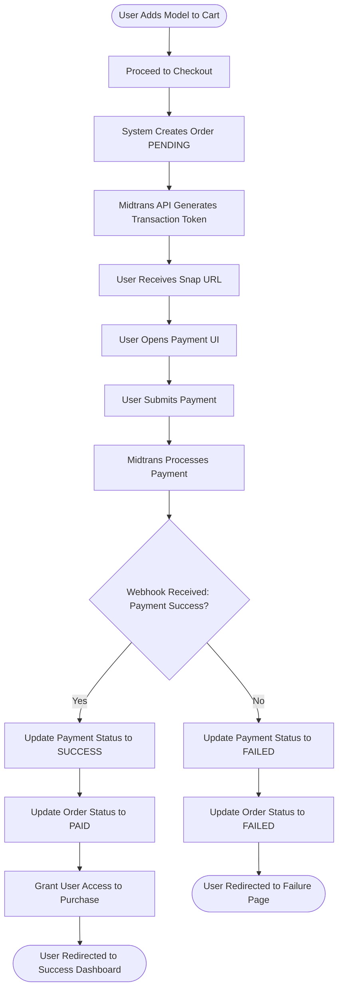

# Checkout and Payment Activity Process

This activity diagram maps the primary user journey and backend system interactions during the cart checkout and Midtrans payment process.

```mermaid
flowchart TD
    Start([User Adds Model to Cart]) --> A[Proceed to Checkout]
    A --> B[System Creates Order PENDING]
    B --> C[Midtrans API Generates Transaction Token]
    C --> D[User Receives Snap URL]
    D --> E[User Opens Payment UI]
    E --> F[User Submits Payment]
    
    F --> G[Midtrans Processes Payment]
    G --> H{Webhook Received: Payment Success?}
    
    H -- Yes --> I[Update Payment Status to SUCCESS]
    I --> J[Update Order Status to PAID]
    J --> K[Grant User Access to Purchase]
    K --> EndSuccess([User Redirected to Success Dashboard])
    
    H -- No --> L[Update Payment Status to FAILED]
    L --> M[Update Order Status to FAILED]
    M --> EndFail([User Redirected to Failure Page])
```
