# Entity Relationship Diagram

This Entity Relationship Diagram (ERD) represents the complete tables, their columns, and their relationships in the 3Dex application explicitly modeling database primary keys, foreign keys, constraints, and relationships.

```mermaid
erDiagram
    User {
        String id PK
        String email UK
        String username UK
        String password
        String google_id UK
        Role role
        Account_Status account_status
        Json array_status_history
        DateTime approved_at
        DateTime rejected_at
        String display_name
        String bio
        String avatar_url
        String banner_url
        String location
        String website
        Json array_addresses
        Json array_portfolio
        Json provider_config
        String social_twitter
        String social_instagram
        String social_artstation
        String social_behance
        Float rating
        Int review_count
        Boolean two_factor_enabled
        DateTime last_login_at
        Boolean show_nsfw
        DateTime created_at
        DateTime updated_at
    }
    
    Model {
        String id PK
        String title
        String description
        Int price "in IDR"
        String file_url
        String preview_url
        String array_gallery_urls
        Model_Status status
        Boolean is_nsfw
        License_Type license
        Boolean is_printable
        String file_format
        String artist_id FK
        String category_id FK
        Float avg_rating
        Int review_count
        DateTime created_at
    }
    
    Purchase {
        String id PK
        String user_id FK
        String model_id FK
        Int price_paid
        License_Type license
        DateTime created_at
    }
    
    Category {
        String id PK
        String name UK
        String slug UK
        DateTime created_at
    }
    
    Tag {
        String id PK
        String name UK
        DateTime created_at
    }
    
    Review {
        String id PK
        Int rating
        String comment
        String user_id FK
        String model_id FK
        DateTime created_at
        DateTime updated_at
    }
    
    Wishlist {
        String id PK
        String user_id FK
        String model_id FK
        DateTime created_at
    }
    
    Cart_Item {
        String id PK
        String user_id FK
        String model_id FK
        Int quantity
        DateTime created_at
        DateTime updated_at
    }
    
    Order {
        String id PK
        String user_id FK
        String provider_id FK
        Int total_amount
        Order_Status status
        Order_Type type
        String courier_name
        String tracking_number
        Json shipping_address
        String snap_token
        String snap_redirect_url
        DateTime created_at
        DateTime updated_at
    }
    
    Order_Item {
        String id PK
        String order_id FK
        String model_id FK
        Int price "unit price in IDR"
        Int quantity
        Json print_config
        Print_Status print_status
        DateTime created_at
    }
    
    Payment {
        String id PK
        String order_id FK
        String transaction_id UK
        String payment_type
        Int gross_amount
        String transaction_status
        String fraud_status
        Json raw_response
        DateTime created_at
    }
    
    User_Review {
        String id PK
        String reviewer_id FK
        String target_user_id FK
        Int rating
        String comment
        DateTime created_at
    }
    
    Post {
        String id PK
        String user_id FK
        String caption
        String array_media_urls
        Boolean is_nsfw
        Int like_count
        Int comment_count
        DateTime created_at
        DateTime updated_at
    }
    
    Post_Like {
        String id PK
        String user_id FK
        String post_id FK
        DateTime created_at
    }
    
    Post_Comment {
        String id PK
        String user_id FK
        String post_id FK
        String content
        DateTime created_at
        DateTime updated_at
    }
    
    Stats {
        String id PK
        DateTime period_start
        DateTime period_end
        Json data
        DateTime created_at
    }
    
    Follow {
        String id PK
        String follower_id FK
        String following_id FK
        DateTime created_at
    }
    
    Notification {
        String id PK
        String user_id FK
        String type
        String title
        String message
        Boolean is_read
        Json data
        DateTime created_at
    }
    
    Collection {
        String id PK
        String user_id FK
        String name
        String description
        Boolean is_public
        DateTime created_at
        DateTime updated_at
    }
    
    Collection_Item {
        String id PK
        String collection_id FK
        String model_id FK
        DateTime added_at
    }
    
    Report {
        String id PK
        String reporter_id FK
        Report_Target target_type
        String model_id FK
        String post_id FK
        String comment_id FK
        String reason
        Report_Status status
        DateTime created_at
    }

    %% Relationships Crow's Foot
    User ||--o{ Model : "creates models"
    User ||--o{ Purchase : "purchases"
    User ||--o{ Review : "writes review"
    User ||--o{ Wishlist : "adds to wishlist"
    User ||--o{ Cart_Item : "adds to cart"
    User ||--o{ Order : "places order"
    User ||--o{ Order : "receives print order"
    User ||--o{ User_Review : "reviews user / reviewed by"
    User ||--o{ Post : "creates post"
    User ||--o{ Post_Like : "likes post"
    User ||--o{ Post_Comment : "comments on post"
    User ||--o{ Follow : "follows / followed by"
    User ||--o{ Notification : "receives"
    User ||--o{ Collection : "creates collection"
    User ||--o{ Report : "reports"

    Model }o--|| Category : "belongs to category"
    Model }o--o{ Tag : "has tags"
    Model ||--|{ Purchase : "is purchased"
    Model ||--o{ Review : "is reviewed"
    Model ||--o{ Wishlist : "is wishlisted"
    Model ||--o{ Cart_Item : "is in cart"
    Model ||--o{ Order_Item : "is ordered"
    Model ||--o{ Collection_Item : "in collection"

    Order ||--|{ Order_Item : "contains items"
    Order ||--|{ Payment : "has payment"
    
    Post ||--o{ Post_Like : "receives likes"
    Post |o--o{ Post_Comment : "commented on"
    
    Collection ||--|{ Collection_Item : "contains items"
```

