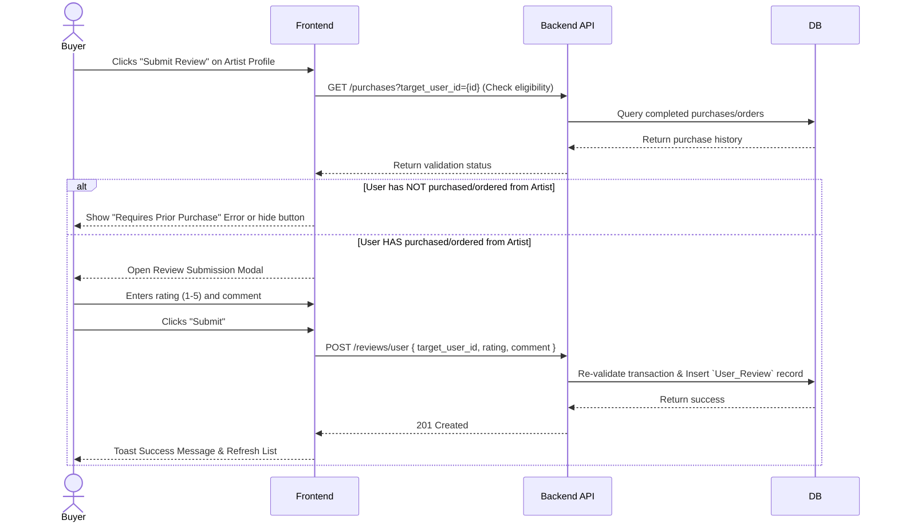

# User Review Submission Flow

This sequence diagram illustrates the workflow of the recently implemented User Review System, which restricts review submissions strictly to verified buyers.

```mermaid
sequenceDiagram
    actor Buyer
    participant Frontend
    participant Backend API
    participant DB

    Buyer->>Frontend: Clicks "Submit Review" on Artist Profile
    Frontend->>Backend API: GET /purchases?target_user_id={id} (Check eligibility)
    Backend API->>DB: Query completed purchases/orders
    DB-->>Backend API: Return purchase history
    Backend API-->>Frontend: Return validation status
    
    alt User has NOT purchased/ordered from Artist
        Frontend-->>Buyer: Show "Requires Prior Purchase" Error or hide button
    else User HAS purchased/ordered from Artist
        Frontend-->>Buyer: Open Review Submission Modal
        Buyer->>Frontend: Enters rating (1-5) and comment
        Buyer->>Frontend: Clicks "Submit"
        Frontend->>Backend API: POST /reviews/user { target_user_id, rating, comment }
        Backend API->>DB: Re-validate transaction & Insert `User_Review` record
        DB-->>Backend API: Return success
        Backend API-->>Frontend: 201 Created
        Frontend-->>Buyer: Toast Success Message & Refresh List
    end
```
