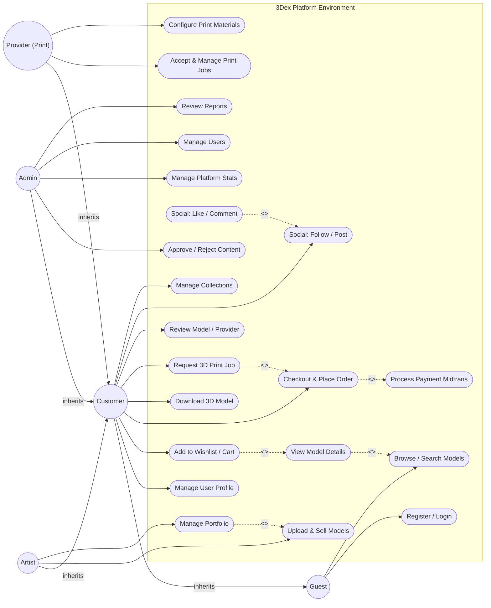

# Use Case Diagram

This diagram represents the use cases derived from the 3Dex application schema, explicitly highlighting actor inheritance (generalization) and use case dependencies (`include` and `extend`).

