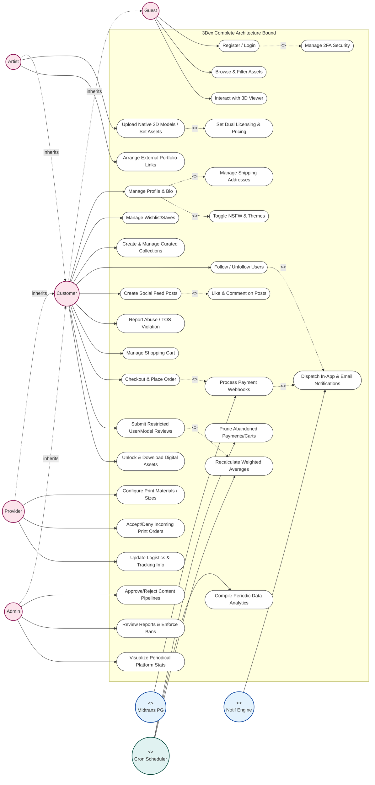

# Godly Use Case Diagram

This exhaustive diagram represents **every** feature, flow, and abstraction boundary within the 3Dex platform. It heavily maps out actor generalization alongside automated triggers originating from autonomous `System` entities (e.g. Midtrans) and `Time` schedulers.

